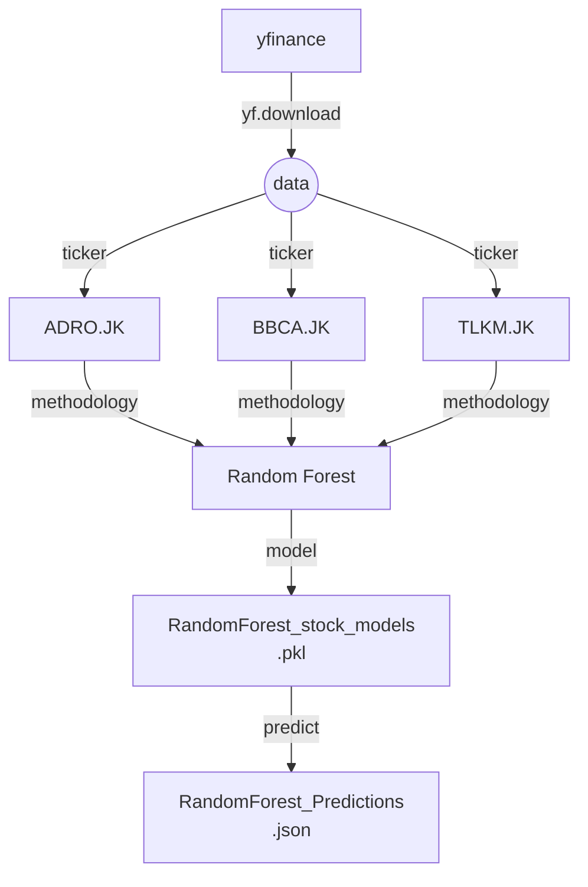
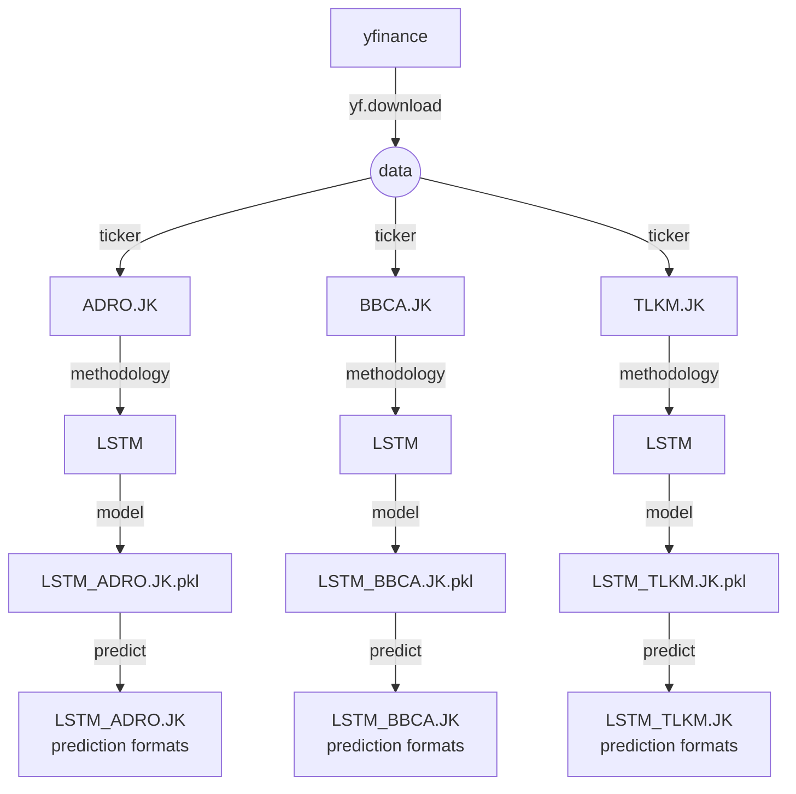
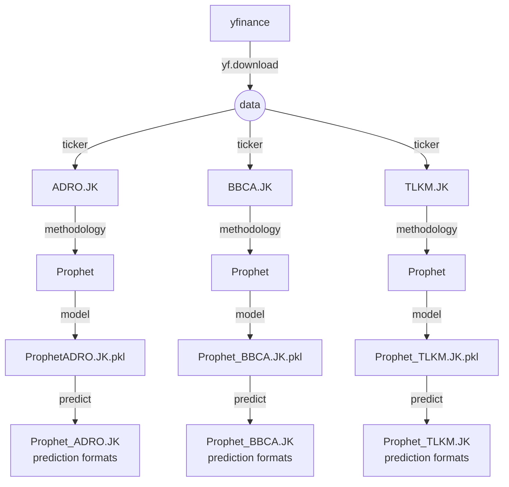

**Midterm Project - Machine Learning Zoomcamp 2024**
# Stock Price Prediction: ADRO.JK, BBCA.JK, TLKM.JK


## Introduction

- **Background**: Completing the Midterm Project Assignment of Machine Learning - Zoomcamp 2024.

- **Problem Statement**: This project is a Machine Learning-based stock price prediction system for three major Indonesian stocks: ADRO.JK ([Adaro Energy](https://www.adaro.com/)), BBCA.JK ([BCA Bank](https://www.bca.co.id/)), and TLKM.JK ([Tekom Indonesia](https://www.telkom.co.id/sites)). The project utilizes Random Forest, LSTM, and Prophet methodologies to analyze historical stock data, generate predictions, and visualize results.
  

## Project Overview
The goal of this project is to:

Predict future stock price trends such as price increase or decrease, daily result, volatility, comparison actual vs prediction.
Provide time-series predictions for stock prices using advanced methods like LSTM and Prophet.
Generate insightful plots comparing historical actual prices with predicted prices.
Build a Dockerized solution that can be deployed on cloud services (AWS EC2).


## Data Description

- **Data Source**: Data is sourced from Yahoo Finance using the yfinance library.
  
- **Data Attributes**: List the key attributes included in the dataset, such as:
    - Date 
    - Open Price (Open)
    - High Price (High)
    - Low Price (Low)
    - Close Price (Close)
    - Adjusted Close Price (Adj_Clouse)
    - Volume (Volume)
    

## Features

1. Random Forest:
    - A single model trained across all tickers.
    - Suitable for short-term binary classification (e.g., predicting price up or down).
    - Limitations: Challenging to predict future prices without new input data.

2. LSTM (Long Short-Term Memory):
    - Separate models for each ticker.
    - Effective for sequential time-series predictions.
    - Generates future stock price predictions (e.g., 7 days or 1 month).

3. Prophet:
    - Separate models for each ticker.
    - Designed for time-series analysis with seasonality and trend components.
    - Predicts future stock prices with detailed trend visualization.

4. Dockerized Environment:
    - Includes all dependencies for easy setup and deployment.

5. AWS Integration:
    - Designed for deployment on AWS EC2 using Terraform.
    

## Architecture

### Random Forest



### LSTM (Long Short-Term Memory)


### Prophet



## Code Functions

### Random Forest

Targets and Features Selections (Engineering)
```
feature_map = {
        'UpDown': [f'{ticker}_Open', f'{ticker}_Close', f'{ticker}_MA1'],
        'DailyReturn': [f'{ticker}_Open', f'{ticker}_Close', f'{ticker}_High', f'{ticker}_Low']
        'Volatility': [f'{ticker}_Open', f'{ticker}_Close', f'{ticker}_Volume', f'{ticker}_MA30']
```

| Ticker   | Target Category | Features Used                                                         |
|----------|-----------------|-----------------------------------------------------------------------|
| ADRO.JK  | UpDown          | `['ADRO.JK_Open', 'ADRO.JK_Close', 'ADRO.JK_MA1']`                    |
| ADRO.JK  | DailyReturn     | `['ADRO.JK_Open', 'ADRO.JK_Close', 'ADRO.JK_High', 'ADRO.JK_Low]`     |
| ADRO.JK  | Volatility      | `['ADRO.JK_Open', 'ADRO.JK_Close', 'ADRO.JK_Volume', 'ADRO.JK_MA30']` |
| BBCA.JK  | UpDown          | `['BBCA.JK_Open', 'BBCA.JK_Close', 'BBCA.JK_MA1']`                    |
| BBCA.JK  | DailyReturn     | `['BBCA.JK_Open', 'BBCA.JK_Close', 'BBCA.JK_High', 'BBCA.JK_Low]`     |
| BBCA.JK  | Volatility      | `['BBCA.JK_Open', 'BBCA.JK_Close', 'BBCA.JK_Volume', 'BBCA.JK_MA30']` |
| TLKM.JK  | UpDown          | `['TLKM.JK_Open', 'TLKM.JK_Close', 'TLKM.JK_MA1']`                    |
| TLKM.JK  | DailyReturn     | `['TLKM.JK_Open', 'TLKM.JK_Close', 'TLKM.JK_High', 'TLKM.JK_Low]`     |
| TLKM.JK  | Volatility      | `['TLKM.JK_Open', 'TLKM.JK_Close', 'TLKM.JK_Volume', 'TLKM.JK_MA30']` |

```
main
├── download_data
├── preprocess_data
├── train_and_evaluate_with_tuning
  ├── tune_hyperparameters
  ├── evaluate_regression_model
  ├── log_evaluation_to_json         # save to outputs/RandomForest_Evaluation_Results.json
  ├── plot_confusion_matrix          # save to outputs/RandomForest_Stock_Analysis_Plots.pdf
  ├── plot_residuals                 # save to outputs/RandomForest_Stock_Analysis_Plots.pdf
├── plot_feature_importances         # save to outputs/RandomForest_Stock_Analysis_Plots.pdf
├── save_model                       # save to models/RandomForest_stock_models.pkl
├── save_final_results_to_json       # save to outputs/RadnomForest_Final_Results.json
```


### LSTM

- Data Input

  LSTM processes sequential data (time sequence). We only need to supply historical data from a variable (for example, closing price) without having to specify additional features like in Random Forest.
  - Data is processed in a sliding window, for example, using the last 30 days to predict the price 1 day ahead.
      
- Output (Target)
  - Future closing price
  
**Comparison of Actual and Predicted Data**

LSTM generates predictions for each time step based on previous data, and these are compared to the actual data using metrics such as:
  - Mean Squared Error (MSE) for numerical predictions.

```
├── download_data
├── tickers_process
  ├── Normalize data
  ├── create_sequences
  ├── Split data
  ├── build_and_train_lstm
  ├── Hyperparameter tuning
  ├── Evaluate best model
  ├── Plot: Actual vs Predicted Prices          # save to outputs/LSTM_{ticker}_Actual_Predicted.png
  ├── Scatter Plot: Predicted vs Actual Prices  # save to outputs/LSTM_{ticker}_Scatter_Actual_Predicted.png
  ├── Save evaluation results to CSV            # save to outputs/LSTM_Evaluation_Results.csv
```


### Prophet

Prophet is a time series prediction model designed to handle trends, seasonality, and holidays automatically. This model is better suited for time series with clear patterns (for example, stock prices with certain trends and cycles).

- Data Input

  Prophet requires two main columns:
    - ds: Date/time.
    - y: The value of the variable to be predicted (target), such as the closing price.
  
  There is no need to specify additional features because Prophet automatically detects trends and seasonal patterns.

- Output (Target)

  The output in Prophet is also a numeric value, usually the y variable to be predicted.
    - closing price

**Comparison of Actual and Predicted Data**

Prophet predicts the value of a target variable for a specified time period in the future, and this can be compared to the actual data using:
  - MSE/MAE to measure the deviation of the prediction from the actual.
  - Plot a graph between the actual and predicted data to visualize performance.

```
├── Download data
├── Align MultiIndex columns to single-level columns
├── Select the Close price for each ticker
├── train and forecast
  ├── tickers process
    ├── Data format for Prophet
    ├── Create Prophet model
    ├── Save the model
    ├── model.predict
    ├── plot Forecast result            # save to utputs/Prophet_{ticker}_Forecast.png
    ├── Save the forecast data to CSV   # save to outputs/Prophet_{ticker}_Forecast.csv
├── Comparison of Actual vs Predicted Stock Prices (IDR)
  ├── tickers process
    ├── Train Prophet model
    ├── Create future dataframe
    ├── Merge actual and predicted values
    ├── Display and save plot          # save to outputs/Prophet_{ticker}_Comparison.png
```


## Repository Structure 
```
stock-prediction
├── app.py
├── code   # scripts
│   ├── notebook.ipynb                # Notebook script ford data preparation and data cleaning, EDA, feature importance analysis
│   ├── predict_LSTM.ipynb            # Prediction script for LSTM
│   ├── predict_LSTM.py               # Prediction script for LSTM
│   ├── predict_Prophet.ipynb         # Prediction script for Propeht
│   ├── predict_Prophet.py            # Prediction script for Propeht
│   ├── predict_RandomForest.ipynb    # Prediction script for RandomForest
│   ├── predict_RandomForest.py       # Prediction script for RandomForest
│   ├── train_LSTM.ipynb              # Training script for LSTM 
│   ├── train_LSTM.py                 # Training script for LSTM
│   ├── train_Prophet.ipynb           # Training script for Prophet
│   ├── train_Prophet.py              # Training script Prophet
│   ├── train_RandomForest.ipynb      # Training script for Random Forest
│   └── train_RandomForest.py         # Training script for Random Forest
├── docker_build.txt                  # Script for build image and container
├── Dockerfile                        # Dockerfile to containerize the application  
├── models  # Final models
│   ├── LSTM_ADRO.JK.pkl              # Final model for LSTM ADRO.JK ticker
│   ├── LSTM_BBCA.JK.pkl              # Final model for LSTM BBCA.JK ticker
│   ├── LSTM_TLKM.JK.pkl              # Final model for LSTM TLKM.JK ticker
│   ├── Prophet_ADRO.JK.pkl           # Final model for Prophet ADRO.JK ticker
│   ├── Prophet_BBCA.JK.pkl           # Final model for Prophet BBCA.JK ticker
│   ├── Prophet_TLKM.JK.pkl           # Final model for Prophet TLKM.JK ticker
│   └── RandomForest_stock_models.pkl # Final model for Random Forest of all tickers
├── outputs                           # Output files: plots, JSON, CSV etc.  
├── predictions                       # Prediction results
├── README.md                         # Project documentation  
├── requirements.txt                  # Python dependencies
└── terraform                         # Terraform scripts for AWS deployment  

```


## Installation
### Prerequisites
  - Python == 3.11
  - Docker
  - AWS account (for cloud deployment)

### Local Setup

*Note: Steps 1 - 5 can be passed if using installed conda environment*

1. Install venv or virtualenv
   venv comes pre-installed with Python 3.3 and above. If it's not available, you can install virtualenv:
    ```
    sudo apt-get install python3.11-venv
    sudo apt-get install python3.11-distutils
    ```

2. Create the Environment
   ```
   python3 -m venv env
   ```
   This will create a virtual environment in the env directory.

3. Add line export PATH=~/.local/bin:$PATH to ~/.bashrc file
   ```
   echo "export PATH=~/.local/bin:$PATH" >> ~/.bashrc
   ```

4. Activate the Environment
   ```
   source env/bin/activate
   ```
   
5. Re-install Qt Plugins for plt.show display
   ```
   sudo apt update
   sudo apt-get install --reinstall qt5-qmake qtbase5-dev qtchooser
   pip install PyQt5
   ```   

6. Install tkinter 
   ```
   sudo apt-get update
   sudo apt-get install python3-tk
   ```
   
7. Clone the repository
   ```
   sudo git clone https://github.com/ketut-garjita/stock-prediction.git
   ```
   
8. Change ownership
   ```
   sudp chown <user>:<group> -R stock-prediction
   ```

9. Install dependencies
   ```
   cd stock-prediction
   pip install -r requirements.txt  
   ```

10. Install or Upgrade Pillow
   ```
   pip install --upgrade --force-reinstall Pillow
   ```
   
11. Train models
     ```
     cd code
     ```

     *Random Forest*
     ```
     python train_RandomForest.py  
     ```
  
     *LSTM*
     ```
     python train_LSTM.py
     ```
  
     *Prophet*
     ```
     python train_Prophet.py
     ```

12. Run predictions

     *Random Forest*
     ```
     python predict_RandomForest.py  
     ```
  
     *LSTM*
     ```
     python predict_LSTM.py  
     ```
  
     *Prophet*
     ```
     python predict_Prophet.py  
     ```

### Docker Setup

1. Build the Docker image
   ```
   docker build -t stock-prediction .
   ```

2. Run the Docker container
   ```
   docker run -d -p 9696:9696 --name stock-prediction-app stock-prediction
   ```

3. Review container status
   ```
   docker ps
   ```

4. Execute train and predict model via stock-prediction-app container
   ```
   docker exec -it stock-prediction-app bash
   cd code
   python --version

   python train_RandomForest.py
   python predict_RandomForest.py

   python train_LSTM.py
   python predict_LSTM.py

   python train_Prophet.py
   python predict_Prophet.py
   ```

5, Review output results in outputs/, model results in models/ and predictions results in predictions/ directory
   
6. Open port 9696
    ```
    sudo ufw enable    # if Firewall is not active and enabled on system startup
    sudo ufw status
    sudo ufw allow 9696
    sudo ufw status
    ```
    
7. Open application
   ```
   http://localhost:9696
   ```

   
## Outputs

 ```
  ├── LSTM_ADRO.JK_Actual_Predicted_Last_30_Days.png
  ├── LSTM_ADRO.JK_Actual_Predicted.png
  ├── LSTM_ADRO.JK_Scatter_Actual_Predicted.png
  ├── LSTM_BBCA.JK_Actual_Predicted_Last_30_Days.png
  ├── LSTM_BBCA.JK_Actual_Predicted.png
  ├── LSTM_BBCA.JK_Scatter_Actual_Predicted.png
  ├── LSTM_Evaluation_Results.csv
  ├── LSTM_TLKM.JK_Actual_Predicted_Last_30_Days.png
  ├── LSTM_TLKM.JK_Actual_Predicted.png
  ├── LSTM_TLKM.JK_Scatter_Actual_Predicted.png
  ├── Prophet_ADRO.JK_Comparison.png
  ├── Prophet_ADRO.JK_Forecast.csv
  ├── Prophet_ADRO.JK_Forecast.png
  ├── Prophet_BBCA.JK_Forecast.csv
  ├── Prophet_BBCA.JK_Forecast.png
  ├── Prophet_TLKM.JK_Forecast.csv
  ├── Prophet_TLKM.JK_Forecast.png
  ├── RadnomForest_Final_Results.json
  ├── RandomForest_Evaluation_Results.json
  ├── RandomForest_Grouped_Results_Report.json
  └── RandomForest_Stock_Analysis_Plots.pdf
 ```

   
## Models
   
Random Forest: Single combined model for binary classification.

LSTM: Separate models for each ticker predicting future prices.

Prophet: Individual models for each ticker with time-series insights.

```
├── LSTM_ADRO.JK.pkl
├── LSTM_BBCA.JK.pkl
├── LSTM_TLKM.JK.pkl
├── Prophet_ADRO.JK.pkl
├── Prophet_BBCA.JK.pkl
├── Prophet_TLKM.JK.pkl
└── RandomForest_stock_models.pkl
```


## Predictions

```
├── LSTM_ADRO.JK_Future_Predictions.csv
├── LSTM_ADRO.JK_Future_Predictions.png
├── LSTM_BBCA.JK_Future_Predictions.csv
├── LSTM_BBCA.JK_Future_Predictions.png
├── LSTM_Future_Predictions_Combined.csv
├── LSTM_Future_Predictions.json
├── LSTM_TLKM.JK_Future_Predictions.csv
├── LSTM_TLKM.JK_Future_Predictions.png
├── Prophet_ADRO.JK_Prediction.csv
├── Prophet_ADRO.JK_Prediction.json
├── Prophet_ADRO.JK_Prediction.png
├── Prophet_BBCA.JK_Prediction.csv
├── Prophet_BBCA.JK_Prediction.json
├── Prophet_BBCA.JK_Prediction.png
├── Prophet_TLKM.JK_Prediction.csv
├── Prophet_TLKM.JK_Prediction.json
├── Prophet_TLKM.JK_Prediction.png
└── RandomForest_Predictions.json
```


## Deployment on AWS Cloud

1. Install Terraform on Linux ([https://developer.hashicorp.com/terraform/install](https://developer.hashicorp.com/terraform/install))
    ```
    wget -O - https://apt.releases.hashicorp.com/gpg | sudo gpg --dearmor -o /usr/share/keyrings/hashicorp-archive-keyring.gpg
    echo "deb [signed-by=/usr/share/keyrings/hashicorp-archive-keyring.gpg] https://apt.releases.hashicorp.com $(lsb_release -cs) main" | sudo tee /etc/apt/sources.list.d/hashicorp.list
    sudo apt update && sudo apt install terraform
    ```

3. Configure Terraform scripts in the terraform/ directory.
   ```
   cd terraform
   ```
   
4. Modiy variable.tf and main.tf
   
   Edit the variable.tf file according to the variable values ​​you have such as: aws_region, ami_name, key_name, instance_type, ec2_instance_name, ip_cidr_blocks.

5. Deploy an EC2 instance by executing terraform commands
   ```
   terraform init
   terraform plan
   terraform apply
   ```

6. Check EC2 instance status
   
      

7. Connect to EC2 instaance via "EC2 Instance Connect" or "SSH Client"

      
   
8. Clone reposistory
   ```
   cd
   git clone https://github.com/ketut-garjita/stock-prediction.git
   ```
   
9. Change ownership
    ```
    sudo chown ubuntu:ubuntu -R stock-prediction/
    ```
   
10. Install libraries listed in requiremenets.txt
    ```
    sudo pip3 install -r requirements.txt
    ```

11. Review libraries installed
    ```
    sudo pip3 list
    ```
   
12. Try train model
    ```
    python3 train_Prophet.py
    ```

13. Run predict
    ```
    python3 predict_Prophet.py
    ```
    
14. Review output and prediction results in ../outputs and ../models directory differently
    

## Visualizations

Visualizations: Incorporate visualizations (compusion matrix, feature importance, residual, model performance graphs, time series prediction, predicted future price) to enhance understanding.

**Exmples**

- Random Forest Results Visualization

  
  

  
  

  
  

  *RandomForest_Grouped_Results_Report*
  
  

  *RandomForest_Evaluation_Results*
  
  


- LSTM Methodology Results Visualization

  

  

  


- Prophet Methodology Results Visualization

  

  

  

  Data Source from Prediction Results: [Prophet_BBCA.JK_Prediction.json](https://github.com/ketut-garjita/stock-prediction/blob/main/predictions/Prophet_BBCA.JK_Prediction.json)


## Challenges and Considerations

- Random Forest Limitations: While effective for classification, this method struggles with long-term predictions due to its dependence on new input features.
- LSTM and Prophet:
  - Require extensive historical data for accuracy.
  - Computationally intensive but provide robust future predictions.
- Based on results, prophet methodology produce the most accurate stock price predictions, as well as  checking historical data comparisons in graphs.


## Suggestions for Improvement
1. Enhance the preprocessing pipeline to handle missing or noisy data.
2. Explore hybrid models (e.g., combining LSTM with Random Forest) for better classification and regression.
3. Integrate a live data feed (e.g., from Yahoo Finance API) to enable real-time predictions.
4. Automate AWS deployment with CI/CD tools like GitHub Actions.


## Acknowledgments
- Data Source: [Yahoo Finance.](https://finance.yahoo.com/)
- Libraries: **pandas, numpy, Scikit-learn, TensorFlow, Prophet, Matplotlib, seaborn, Flask, Docker, yfinance, statsmodels**. 
